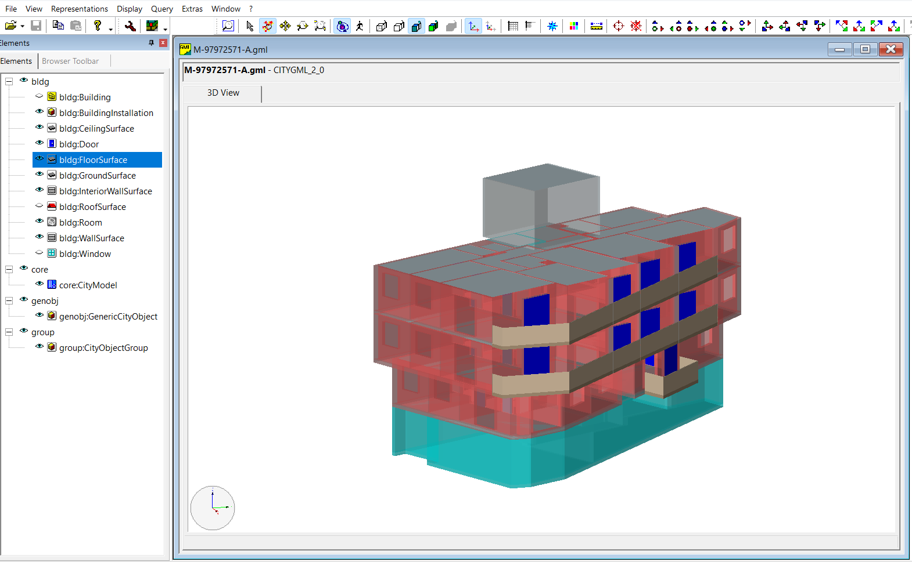
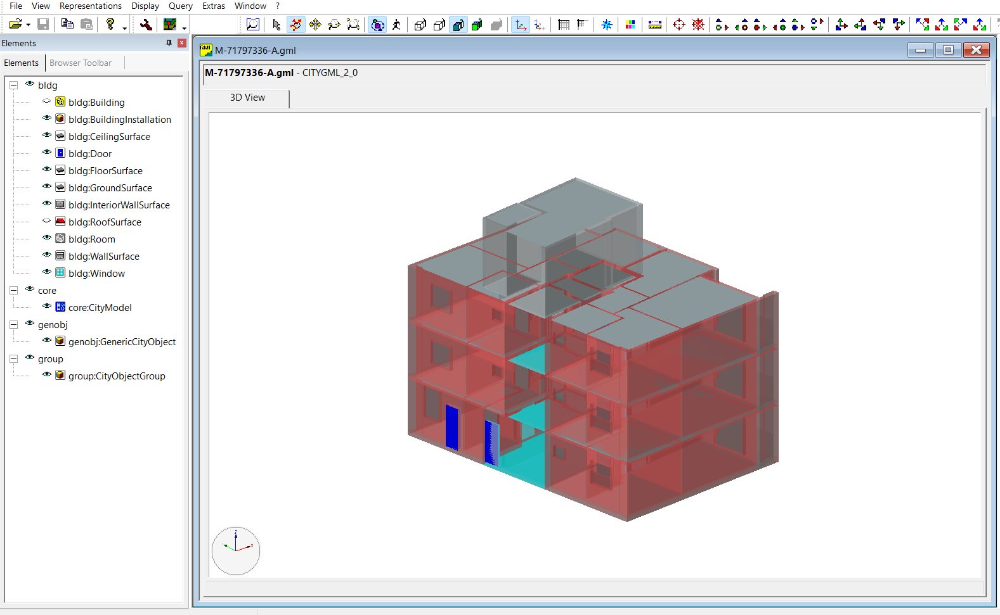

# Human-Centered Accessibility & Flow Analysis

A Python project that extracts building connectivity networks from CityGML data to analyze accessibility from a human-centered perspective.

---

## Features

### Phase 1: Basic Network Analysis
- CityGML parsing and building extraction
- Network graph construction
- Network analysis (centrality, shortest paths)
- Basic accessibility metrics
- Simple visualizations

### Phase 2: Human-Centered Analysis
- User Profile Analysis: Analyzing accessibility for different user groups (5 profiles)
- Flow Simulation: Simulating human flow patterns
- Emergency Scenarios: Emergency evacuation analysis

### Phase 3: Human-Centered Visualization
- User accessibility visualizations
- Flow simulation visualization
- Emergency evacuation visualization

---

## Sample Data

The project processes CityGML files containing building data. Below are examples of the 3D building models used in this analysis:


*Sample building model from CityGML data (M-71797336-A.gml)*


*Sample building model from CityGML data (M-97972571-A.gml)*

---

## Project Structure

```
human-centered-accessibility-analysis/
├── README.md
├── requirements.txt
├── config/
│   ├── user_profiles.json
│   ├── flow_scenarios.json
│   ├── emergency_scenarios.json
│   └── analysis_config.yaml
├── data/
│   ├── input/
│   ├── processed/
│   └── output/
├── scripts/
│   ├── 1_extract_buildings.py
│   ├── 2_build_network.py
│   ├── 3_analyze_network.py
│   ├── 4_calculate_accessibility.py
│   ├── 5_user_profiles.py
│   ├── 6_flow_simulation.py
│   ├── 7_emergency_scenarios.py
│   ├── 8_human_centered_visualization.py
│   └── run_pipeline.py
└── utils/
    ├── gml_parser.py
    ├── network_utils.py
    ├── visualization_utils.py
    ├── user_profiles.py
    ├── flow_simulation.py
    └── emergency_utils.py
```

---

## Quick Start

### Installation
```bash
pip install -r requirements.txt
```

### Usage
```bash
python scripts/run_pipeline.py --input "data/input/*.gml" --output data/output/ --threshold 500
```

### Expected Outputs
- Building data extraction
- Network graph construction
- User profile analysis
- Flow simulation
- Emergency evacuation analysis
- Visualizations

---

## Technical Details

### Libraries Used
- `lxml` - GML file parsing
- `shapely` - Geometric operations
- `geopandas` - Geospatial data
- `networkx` - Network analysis
- `pandas` - Data manipulation
- `numpy` - Numerical operations
- `matplotlib` - Visualization
- `scipy` - Spatial analysis

### Data Formats
- **Input:** CityGML (.gml) files
- **Config:** JSON (user profiles, scenarios), YAML (analysis config)
- **Output:** CSV, JSON, PNG

---

## Author

**Süleyman Sarılar**

GitHub: https://github.com/suleymansarilar

---

## License

This project is open source and available under the MIT License.

---

## Acknowledgments

- CityGML community
- NetworkX, pandas, and matplotlib documentation
- Various online tutorials and resources
